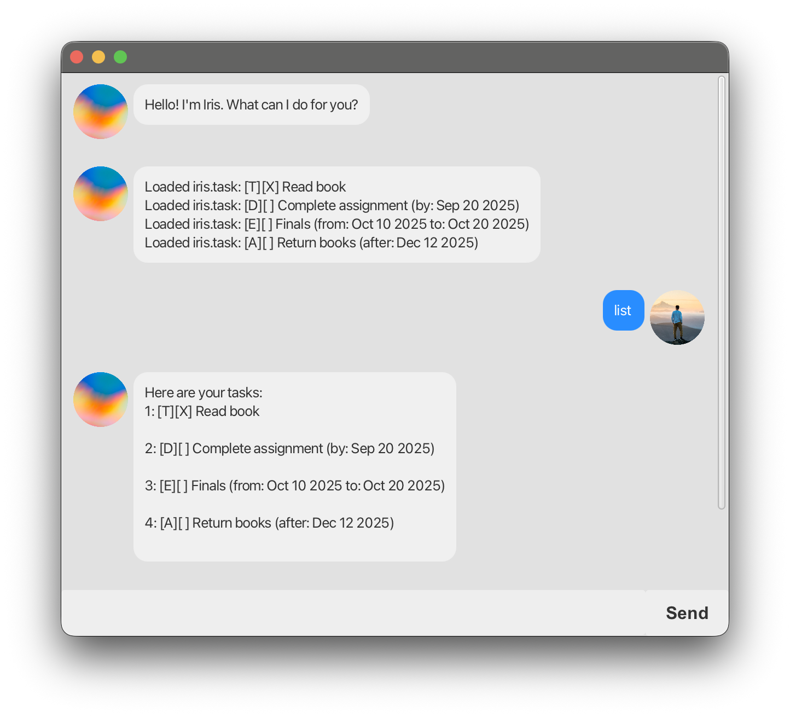

# Iris User Guide



Iris is a lightweight task manager. It supports Todos, Deadlines, Events, and Do-After tasks via simple commands.

## Quick Start

1. Start the app: `java -jar Iris.jar`
2. Type commands into the input box and press Enter.
3. Iris responds in the conversation panel.

## Commands

### 1. List tasks — `list`

Shows all tasks.

Example:

```
list
```

Output:

```
Here are your tasks:
1: [T][ ] buy milk

2: [D][ ] CS2103T iP (by: Sep 30 2025)

3: [E][ ] Hackathon (from: Oct 10 2025 to: Oct 12 2025)
```

---

### 2. Add a todo — `todo <description>`

Adds a todo task.

Example:

```
todo buy milk
```

Output:

```
Added new iris.task:
[T][ ] buy milk
```

---

### 3. Add a deadline — `deadline <description> /by <yyyy-MM-dd>`

Adds a deadline with a due date.

Example:

```
deadline CS2103T iP /by 2025-09-30
```

Output:

```
Added new iris.task:
[D][ ] CS2103T iP (by: Sep 30 2025)
```

---

### 4. Add an event — `event <description> /from <yyyy-MM-dd> /to <yyyy-MM-dd>`

Adds an event with a start and end date.

Example:

```
event Hackathon /from 2025-10-10 /to 2025-10-12
```

Output:

```
Added new iris.task:
[E][ ] Hackathon (from: Oct 10 2025 to: Oct 12 2025)
```

---

### 5. Add a do-after task — `doafter <description> /after <yyyy-MM-dd>`

Adds a task that should be done after a specific date.

Example:

```
doafter Return library book /after 2025-10-05
```

Output:

```
Added new iris.task:
[A][ ] Return library book (after: Oct 5 2025)
```

---

### 6. Find tasks — `find <keyword>`

Shows tasks whose descriptions contain the keyword.

Example:

```
find book
```

Output:

```
Here are the matching tasks in your list:
1: [A][ ] Return library book (after: Oct 5 2025)
```

---

### 7. Delete a task — `delete <item-number>`

Deletes the task at the given list number.

Example:

```
delete 2
```

Output:

```
I've deleted this iris.task:
[D][ ] CS2103T iP (by: Sep 30 2025)
You have 2 tasks left.
```

---

### 8. Mark a task done — `mark <item-number>`

Marks the task as done.

Example:

```
mark 1
```

Output:

```
I've marked this iris.task as done:
[T][X] buy milk
```

---

### 9. Unmark a task — `unmark <item-number>`

Marks the task as not done.

Example:

```
unmark 1
```

Output:

```
I've marked this iris.task to be completed:
[T][ ] buy milk
```

---

### 10. Exit — `bye`

Closes the session.

Example:

```
bye
```

Output:

```
Bye, see you soon!
```

## Notes & Tips

- If a command is malformed, Iris shows a usage hint, e.g.:
  ```
  Incorrect usage of the "deadline" command.
  Usage: deadline <description> /by <date>
  ```
- On startup, Iris attempts to load tasks from `data.txt`. Malformed lines are skipped with an error message in the conversation.
- Dates are shown in the UI as `MMM d yyyy` (e.g., `Oct 5 2025`).
